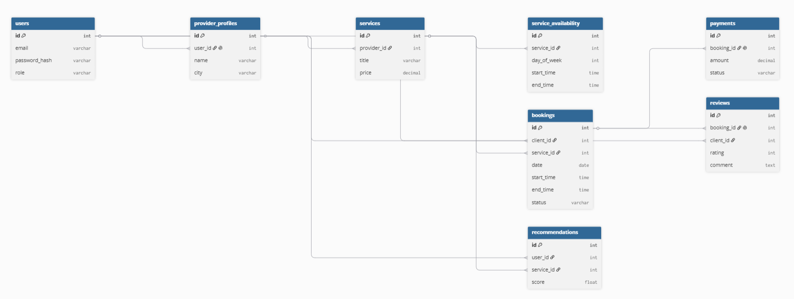
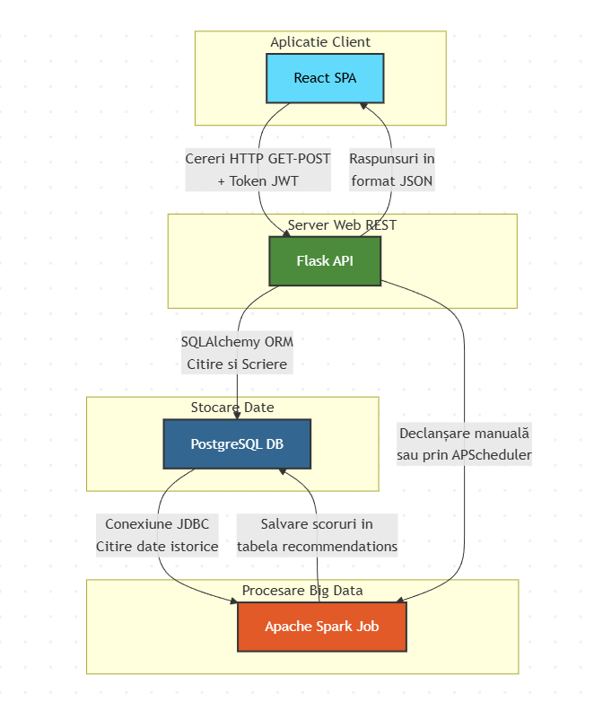

# Proiect 10 — Marketplace de Servicii Locale

Un marketplace web modern dedicat serviciilor locale (meditații, design, reparații, curățenie etc.), unde furnizorii își pot lista serviciile, iar clienții pot căuta, rezerva și plăti simulat. Aplicația include un motor de recomandări inteligent implementat în Apache Spark.

Proiect realizat în cadrul stagiului de practică **BMadlen 071727 SRL**.
* **Tutor de practică:** Madalina Ivona Bejenariu
* **Perioada:** 22.06.2026 - 12.09.2026
* **Volum orar alocat:** 80h

---

##  Concepte Teoretice de Bază & Rolul Tehnologiilor

Pentru implementarea acestui sistem, utilizăm un stack tehnologic hibrid care acoperă dezvoltarea web tradițională și ingineria datelor.

### 1. Arhitectura REST API (Flask & Python)
* **Ce este:** REST (Representational State Transfer) este un stil de arhitectură software pentru sistemele distribuite. Comunicarea se face prin protocoale standard HTTP utilizând verbe specifice (GET pentru citire, POST pentru creare, PUT/PATCH pentru actualizare, DELETE pentru ștergere).
* **Rolul în proiect:** Flask va funcționa exclusiv ca un **Backend API**. Nu va randa pagini HTML, ci va returna date în format JSON către interfața React. Aplicația va fi modularizată prin **Flask Blueprints**, izolând logica pe domenii distincte: auth, services, bookings, reviews și recommendations.

### 2. Autentificare Stateless prin JWT (JSON Web Tokens)
* **Ce este:** Un mecanism de securitate compact și autonom pentru transmiterea securizată a informațiilor între părți sub forma unui obiect JSON semnat digital.
* **Rolul în proiect:** Deoarece API-ul este stateless (nu păstrează sesiuni pe server), la login utilizatorul primește un token JWT. React va stoca acest token și îl va trimite în header-ul fiecărei cereri HTTP. Flask va decoda token-ul pentru a valida identitatea și **rolul utilizatorului** (Client, Furnizor, Admin) înainte de a permite accesul la rutele protejate.

### 3. Persistența Datelor & ORM (PostgreSQL & SQLAlchemy)
* **Ce este:** PostgreSQL este un sistem de gestiune a bazelor de date relaționale (RDBMS) de înaltă performanță. SQLAlchemy este un Object-Relational Mapper (ORM) care permite interacțiunea cu baza de date folosind clase și obiecte Python în loc de interogări SQL brute.
* **Rolul în proiect:** Definim structura celor 8 tabele obligatorii (`users`, `provider_profiles`, `services`, `service_availability`, `bookings`, `payments`, `reviews`, `recommendations`) sub formă de modele Python. Relațiile dintre ele vor fi gestionate automat de ORM. Pentru a valida rapid conflictele de timp, vom folosi un index compus optimizat pe `bookings(provider_id, date, start_time, end_time)`.

### 4. Interfață Reactivă SPA (React)
* **Ce este:** React este o librărie JavaScript bazată pe componente pentru construirea de interfețe Single Page Application (SPA), unde navigarea între pagini se face instantaneu, fără reîncărcarea completă a browser-ului.
* **Rolul în proiect:** Consumă endpoint-urile create în Flask. Va conține pagini dedicate pentru formularele de căutare, profilele detaliate ale furnizorilor, un calendar de disponibilitate per serviciu și dashboard-uri analitice cu grafice simple pentru venituri (folosind Chart.js sau Recharts).

### 5. Procesare Distribuită & Recomandări (Apache Spark / PySpark)
* **Ce este:** Apache Spark este un motor de analiză unificat, ultra-rapid, conceput pentru procesarea de date la scară largă (Big Data) în memorie.
* **Rolul în proiect:** Rulează separat de serverul web. Printr-un job PySpark, sistemul se va conecta direct la PostgreSQL via **JDBC**, va citi tabelele de rezervări și servicii și va procesa în memorie un algoritm de scoring. Spark va calcula scoruri pe baza frecvenței categoriilor rezervate anterior, a popularității serviciilor în același oraș și a ratingului mediu al furnizorului, salvând Top 5 recomandări înapoi în baza de date.

---

##  Pașii Logici de Implementare a Aplicației

Proiectul va fi dezvoltat incremental, trecând de la structura de date la logica de business și, în final, la analiza de date:

### Faza 1: Proiectarea Structurii (Baza de Date & Diagrame)
1. Elaborarea diagramei **ERD** (Entity Relationship Diagram) pentru definirea cheilor primare/străine din cele 8 tabele specificate în brief.

2. Construirea diagramei de arhitectură solicitată: Flask API + Spark job + PostgreSQL + React.

### Faza 2: Infrastructura Backend (REST API de bază)
1. Inițializarea proiectului Python și structurarea pe **Blueprints** (auth, services, bookings, reviews, recommendations).
2. Configurarea modelelor în SQLAlchemy și maparea lor în baza de date locală PostgreSQL.
3. Implementarea modulului de autentificare și generarea token-urilor JWT pe bază de roluri.

### Faza 3: Logica Core de Business (Fluxul Marketplace-ului)
1. Dezvoltarea endpoint-urilor de CRUD pentru furnizori (creare profil, adăugare servicii și intervale de disponibilitate).
2. Implementarea motorului de căutare dinamic (filtrare după categorie, oraș și preț maxim).
3. Dezvoltarea logicii stricte de rezervări: algoritm în backend care blochează suprapunerile pe același furnizor în același interval.
4. Simularea fluxului de plată (tranzacție fictivă: `pending` ➔ `confirmed`) și modulul de adăugare recenzii permis doar după finalizarea serviciului.

### Faza 4: Interfața Utilizator (Frontend React)
1. Configurarea router-ului în React și crearea paginilor principale (Home, Rezultate căutare, Profil furnizor, Detalii serviciu).
2. Integrarea calendarului de disponibilitate per serviciu și a secțiunii de "Servicii Recomandate".
3. Construirea dashboard-urilor dedicate (Client și Furnizor), inclusiv graficele pentru venituri.

### Faza 5: Inteligența Datelor (Job-ul Apache Spark)
1. Scrierea scriptului PySpark care inițializează sesiunea Spark și citește datele din PostgreSQL via JDBC.
2. Implementarea formulei de calcul pentru recomandări și salvarea rezultatelor în tabela `recommendations`.
3. Configurarea **APScheduler** pentru execuția automată săptămânală și crearea unui buton în panoul de admin pentru declanșarea manuală.

---

## 🎯 Criterii de Acceptanță (Ce trebuie să funcționeze la final)
* Aplicația pornește fără erori direct din instrucțiuni.
* Toate cele 3 roluri (Client, Furnizor, Admin) sunt funcționale cu permisiunile corecte.
* Fluxul complet este funcțional cap-coadă: *Căutare ➔ Rezervare ➔ Plată Simulată ➔ Finalizare ➔ Recenzie*.
* Conflictele de rezervare sunt detectate și blocate automat în backend.
* Job-ul Spark rulează, calculează corect recomandările, le salvează în BD și acestea devin vizibile în UI-ul clientului.
* Venitul furnizorului este calculat corect din rezervările finalizate.
